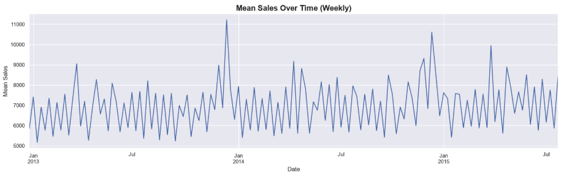
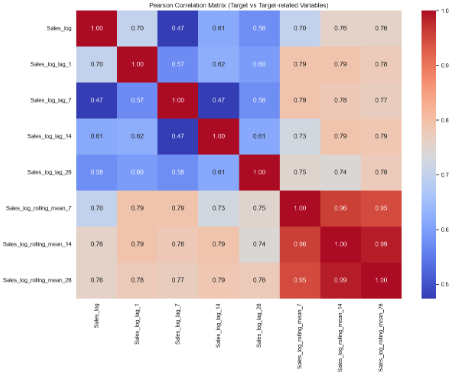
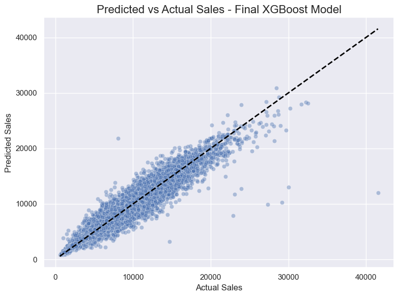
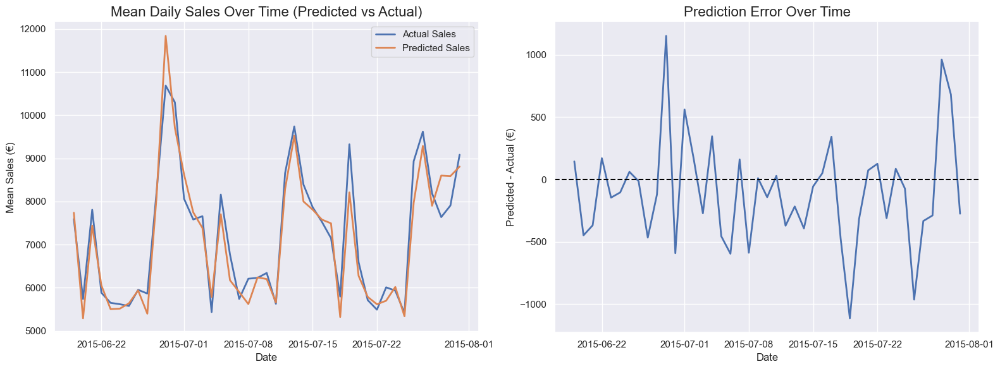
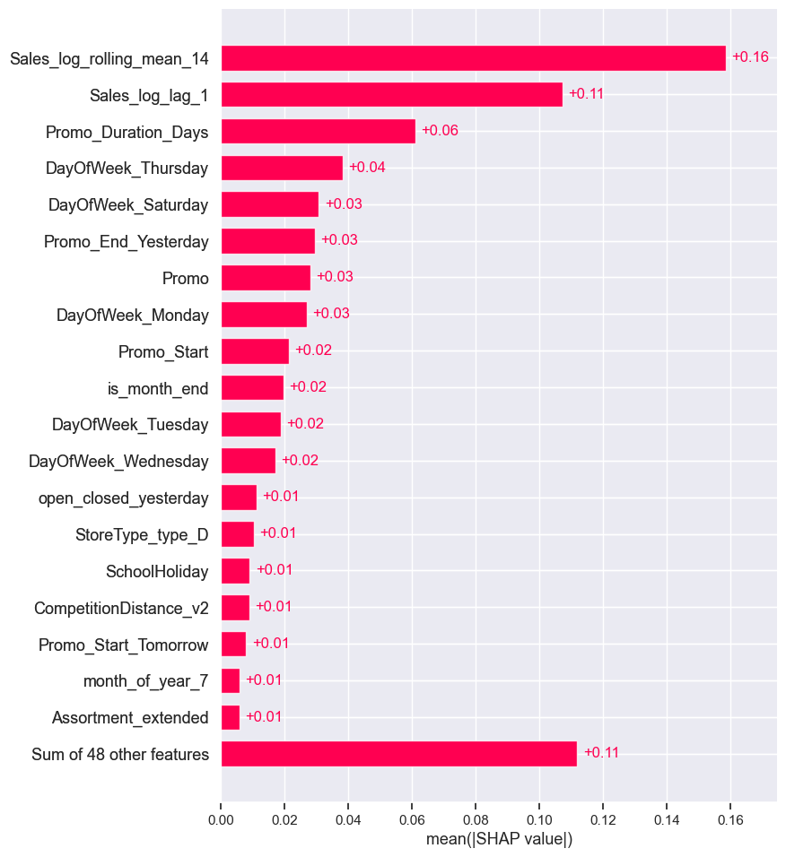
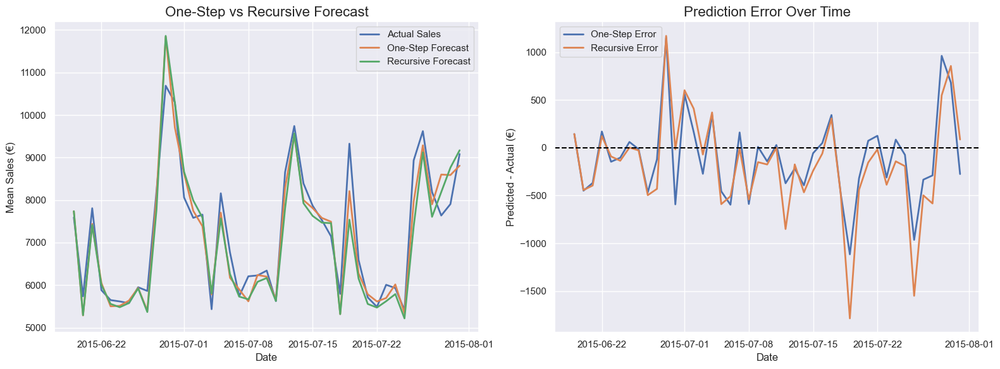
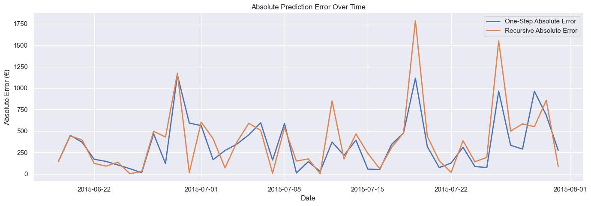

# **Rossmann Store Sales Forecasting**
## *End-to-End Time Series Forecasting Project with Machine Learning*

## 🎯 1. Project Overview & Goals


Rossmann is one of the largest retail chains in Europe, specializing in cosmetics, personal care, and household products. Reliable sales forecasting is crucial for retail operations, as it supports inventory management, workforce scheduling, promotional planning, budgeting, supplier coordination, and strategic business decisions.

This project is based on the real-world Rossmann Store Sales Kaggle competition, where **the objective was to predict daily sales for 1,115 stores operating across Germany up to six weeks in advance** using information on promotions, competition, store characteristics, and calendar effects. 

The data used in this project covers **the period from 01-01-2013 to 31-07-2015**, providing over two and a half years of historical daily sales observations.

The **main goal of this project was to build an accurate and interpretable forecasting model while following realistic time-series forecasting principles**. Particular attention was devoted to **data leakage prevention, time-based validation, and robust feature engineering**.

In addition to traditional one-step forecasting, **a recursive forecasting approach** was implemented **to better simulate real-world production conditions** where future lag values are unknown.

The project also incorporates **model explainability techniques** to identify key sales drivers and generate business-oriented insights that can support retail decision-making.

The entire workflow follows the **CRISP-DM** methodology, covering business understanding, data understanding, data preparation, modeling, evaluation, and *future deployment*.


## 🌟 2. Key Highlights

✔ Built and tuned **ML forecasting models** to predict daily sales for 1,115 retail stores across Germany up to six weeks ahead.

✔ Created **30+ features** capturing historical sales dynamics (lags, rollings means), promotions, seasonality, calendar effects, holiday periods, and competition.

✔ Implemented **leakage-aware feature engineering** and **time-series validation procedures** to ensure realistic model evaluation.

✔ Implemented a **recursive forecasting framework** and compared its performance against the traditional one-step forecasting approach.

✔ Compared **baseline**, linear, and tree-based models using **RMSPE** (the official Kaggle evaluation metric) as well as additional performance metrics.

✔ Applied **SHAP explainability** techniques to identify the most important sales drivers and interpret model behavior.

✔ Performed comprehensive exploratory data analysis, including univariate, bivariate, and multivariate investigations.

✔ Conducted detailed data quality validation, including missing values, suspicious observations, and outlier analysis.

✔ Reconstructed **German federal states** using holiday-calendar similarity matrices, enabling additional regional analysis and feature creation.

🚧 Deployment of an interactive forecasting and scenario-analysis application is currently in progress.


## 🌐 3. Data Sources

**Main data source:** [LINK](https://www.kaggle.com/competitions/rossmann-store-sales/overview) (Kaggle Rossmann Store Sales Competition)

### Files included: 
1. `"store.csv"` - contains information about the included stores (store type, assortment, nearest competition, ongoing promotional campaigns)
2. `"train.csv"` - contains information about daily sales (target), number of customers, current promotional activities, public and school holidays, and whether the store was open
3. `"test.csv"` - contains similar information to the train set, but without sales and customer numbers; *it was not used during model development because the project focused on model evaluation and forecasting based on historical observations with known outcomes*

### Dataset summary
- **Period:** 2013-01-01 to 2015-07-31 (to 2015-09-17 if test set included)
- **Stores:** 1,115
- **Frequency:** Daily
- **Forecast Horizon:** 42 days
- **Target Variable:** Sales

### External data (for German federal states extraction):
1. `"holidays.school.XX.csv"` (16 files) & `"subdivisions.csv"` [[LINK](https://www.kaggle.com/competitions/rossmann-store-sales/overview)] - raw data containing school holiday calendars for each German federal state, used for region extraction
2. `"store_states.csv"` [[LINK](https://www.kaggle.com/competitions/rossmann-store-sales/discussion/17048)] - publicly available land extraction results, which were compared with own results


## 📂 4. Project Structure

```
/01_data/
├── /01_raw/
    ├── /01_Rossmann/
        ├── store.csv 
        ├── train.csv
        ├── test.csv
    ├── /02_external/
        ├──data-holidays
            ├── holidays.school.XX.csv # where XX is the two-letter abbreviation for the land name (e.g., BE - Berlin)
            ├── subdivisions.csv
        ├── store_states.csv 
├── /02_processed/
    ├── /01_Rossmann/
        ├── rossmann_data_processed_final.parquet # csv too large
    ├── /02_external/
        ├── state_per_store_assignment.csv # contain information about the federal states assigned to stores
        ├── weather_data_processed.csv # weather data for individual states extracted using the Open-Meteo API
├── /03_modeling/
    ├── rossmann_dataset_for_modeling_final.parquet # csv too large

/02_notebooks/
├── 01_Rossmann_data_processing.ipynb
├── 02_External_data_processing.ipynb
├── 03_Modeling_and_evaluation.ipynb
├── 04_Recursive_forecasting.ipynb

/03_models/
├── ridge_regression_tuned.pkl
├── lasso_regression_tuned.pkl
├── xgboost_tuned_v1.pkl # final model
├── xgboost_tuned_v2.pkl 

/04_images/ # selected plots shown in README

.gitignore
README.md # Project description, key highlights & results summary, lessons learned
requirement.txt

```

Note: Random Forest model files (.pkl) are not included in the repository due to their large size. The final deployed model is XGBoost (V1), which is included in the `03_models/` directory.

## 🔍 5. Exploratory Data Analysis

**Examples of findings from EDA:**

- Sales distribution is **right-skewed**, motivating the use of a **log transformation**.
- Sales exhibit **strong weekly, monthly, and yearly seasonality** patterns.
- Short-term **promotions and holiday periods** subtantially **increase sales**.
- **Day-of-week** effects have a **strong impact on sales**.
- **Historical sales features** (lags and rolling means) show the **strongest relationship** with future sales.
- Several original variables required **redesign to prevent future information leakage**.
- Regional differences between German federal states suggest **location-specific purchasing patterns**.
- Several **high-performing stores** were identified as outliers; however, they were retained because they represent **real business cases** rather than data quality issues.


### Weekly Mean `Sales` Over Time:


### Correlation Matrix (Pearson) - `Sales_log` (Y) vs Lags/Rolling Means


## ⚙️ 6. Feature Engineering

More than **30 features** were engineered and tested:

### Sales history

- Lag features (1, 7, 14, 28 days)
- Rolling mean features (7, 14, 28 days)

### Promotional activities

- Short-term promotion start/end indicators
- Short-term promotion duration features
- Long-term promotion activity and duration features

### Calendar effects & holidays

- Day of week, week of month, month, quarter
- Month begin/end indicators
- Pre-Christmas and Pre-Easter periods (1, 2, 3 weeks)
- Special-event indicators 

### Operational effects

- Open today, but closed yesterday indicator
- Open today, but closed tomorrow indicator

### Competition

- Nearest competition existence and duration
- Distance to nearest competitor 


## 🏆 7. Modeling & Evaluation (One-Step Approach)

The modeling process began by building a set of **simple baseline models**, in which Y (`Sales_log`) was explained by the lag or rolling mean of Y. The results for the best baseline (`Sales_log_rolling_mean_14`) are presented in the first row of the table below. The table shows the **model results on the test set (2015-06-19 to 2015-07-31)**.

The main metric used to evaluate models and select the final one was **RMSPE (Root Mean Squared Percentage Error)** - the same metric as used in the official Rossmann competition. Additionally, values for more popular metrics **(R2, MAE, RMSE)** are also presented.


### Table: model results
| Model                | R²     | MAE      | RMSE      | RMSPE  |
|----------------------|--------|----------|-----------|--------|
| Best Baseline        | 0.64   |1306      | 1826.8    | 0.2835 |
| Linear Regression    | 0.85   |797.1     | 1178.4    | 0.1835 |
| Ridge Regression     | 0.85   |797.1     | 1178.4    | 0.1835 |
| Lasso Regression     | 0.85   |796.7     | 1177.8    | 0.1835 |
| Random Forest (V1)   | 0.91   |613.7     | 909.2     | 0.1205 |
| Random Forest (V2)   | 0.91   |606.3     | 893.1     | 0.1194 |
| **XGBoost (V1)**     |**0.92**|**607.0** |**882.3**  |**0.1205** | 
| XGBoost (V2)         | 0.89   |638.4     | 988.8     | 0.1341 |

Although Random Forest (V2*) achieved slightly lower RMSPE on the test set, **XGBoost (V1) was selected as the final model** because it provided the **best balance between predictive performance and generalization ability**. In particular, it exhibited substantially lower train-test performance gaps across evaluation metrics, indicating a **lower risk of overfitting and more robust performance on unseen data**.

XGBoost (V1) explains approximately **92%** of sales variability and achieves an average percentage forecasting error of **12.1%**. Considering the complexity of retail sales forecasting, the obtained results indicate strong predictive performance.

###### *V2 models additionally include a 7-day lag feature, while V1 models rely on a simpler feature set.


### Predicted vs Actual - Final XGBoost Model (Test Set):

#### a) Scatter plot


#### b) Mean daily sales for all stores & prediction error over time



## 💡 8. Explainability (SHAP) & Business Insights

SHAP analysis was applied to the final XGBoost (V1) model to identify the factors that drive sales predictions. The results were highly consistent with findings from EDA and feature importance analysis, increasing confidence in the robustness of the identified relationships.

### Key Findings:

#### Sales Dynamics

- Recent sales history is the strongest predictor of future demand.
- Medium-term sales trends (14-day rolling mean) are more informative than individual daily fluctuations (1-day lag).

#### Promotion Effects

- Promotional features rank among the most influential predictors in the model.
- Sales tend to increase around the beginning of promotional campaigns and weaken shortly after promotions end.
- The timing and duration of promotions appear to be as important as the promotion itself.

#### Calendar Effects

- Weekly purchasing patterns remain important even after accounting for promotions and historical sales.
- Certain weekdays consistently exhibit higher demand levels, suggesting stable customer shopping routines.

### Business Implications:

- Inventory planning should be based on both recent sales trends and upcoming promotional activities rather than historical sales alone.
- Promotion planning should consider not only whether a campaign is launched, but also its timing, duration, and expected post-promotion effects.
- The observed sales decline after promotions suggests that some purchases are shifted in time rather than fully generated by the campaign itself.
- Weekly demand patterns should be incorporated into staffing, replenishment, and promotional planning decisions.
- Demand often increases immediately after store closures, indicating potential benefits from additional staffing and inventory availability on reopening days.


### SHAP Bar Plot:



## 🧩 9. Recursive Forecasting & Comparison with the One-Step Approach

In the simplied **one-step forecasting approach** (e.g., XGBoost V1) target-related features (`Sales_log_lag_1`, `Sales_log_rolling_mean_14`) were engineered by **using actual historical sales**. 

In production environments, future lag and rolling features are unavailable because future sales **are unknown**.

Therefore, a **recursive forecasting** framework was implemented to **simulate a more realistic, production-oriented conditions**. Despite relying on its own predicitions, the recursive setup remained **stable over the entire 42-day forecasting horizon** and produced **only a moderate increase in RMSPE** compared with the original XGBoost (V1) results. It suggests that forecasting accuracy remains relatively stable.

An alternative approach is **direct forecasting**, where separate models are trained for each forecasting horizon. While often more robust (no error accumulation), it requires substantially greater computational efforts.


### Predicted vs Actual: One-Step and Recursive Approach (Test Set)


### Absolute Prediction Error Over Time (Test Set):



## 💪 10. Challenges & Lessons Learned 

### 👉 LESSON 1: Data Leakage Prevention is Crucial for Model Reliability

Preventing information leakage plays a huge role in the reliability of a model and the validity of the obtained results. A model can achieve excellent performance metrics, but if it relies on information from the future, it is not suitable for decision-making or deployment in a real-world production environment.
Data leakage prevention is crucial both during feature engineering and model development.

*More information on the leakage prevention methods implemented throughout the project can be found in the **next section**.*

### 👉 LESSON 2: Feature Engineering Drives Forecasting Performance

The largest model performance improvements came from feature engineering rather than from selecting more advanced algorithms. Creating time-aware and leakage-free promotion, competition, and calendar-related variables generated substantially more value than simply testing additional machine learning models.

### 👉 LESSON 3: Time Series Forecasting Requires Different Validation Procedures

Unlike standard machine learning problems, forecasting models require time-based validation. Traditional random train-test splits can introduce information leakage and lead to overly optimistic performance estimates. TimeSeriesSplit and chronological train-test partitions provide a much more realistic assessment of model quality.

### 👉 LESSON 4: Recursive Forecasting Better Reflects Production Conditions 

Models relying on lag and rolling statistics often achieve optimistic results when evaluated using observed future values. Recursive forecasting provides a more realistic estimate of production performance by generating future lag features from previous predictions rather than actual sales observations.

### 👉 Additional Challenge: German Federal States Reconstruction

The original dataset does not contain information about store locations. To capture regional differences in school holiday calendars, stores were assigned to German federal states using similarity-based matching techniques.

Although the task was challenging due to occasionally overlapping holiday schedules and subtle differences between some regions, the final assignments proved sufficiently consistent for analytical purposes. This not only enabled additional regional insights, but also created new feature engineering opportunities and slightly improved model performance.


## ⚠️ 11. Data Leakage Prevention - Implemented Measures

Several safeguards were implemented to ensure realistic model evaluation and production readiness:

- Removal of variables unavailable at prediction time (e.g., daily customer counts)
- Recreation of promotion and competition features using only information available at the observation date (no future promotion schedules or future competitors)
- Chronological, time-based train-test split
- TimeSeriesSplit cross-validation
- Leakage-free lag and rolling mean feature generation
- Recursive forecasting simulation for production-oriented evaluation


## 🚀 12. Model Deployment

*Deployment is currently in progress*

*The planned solution includes an interactive forecasting application (Streamlit) that will allow users to generate sales forecasts for selected stores, compare different forecasting scenarios, and evaluate the impact of promotional activites on expected sales*


## ✨ 13. Potential Improvements & Next Steps

### Currently Working On:

- Automated feature engineering pipeline and model deployment (Streamlit, FastAPI, Docker,...)
- Interactive application with possible "what-if" business scenarios

### Could be tested:
- Direct forecasting approach
- Hyperparamter optimization with larger search spaces (e.g., more iterations)


## 🛠️ 14. Technologies
- Python
- Numpy, Pandas
- Scikit-learn, XGBoost
- Matplotlib, Seaborn
- SHAP
